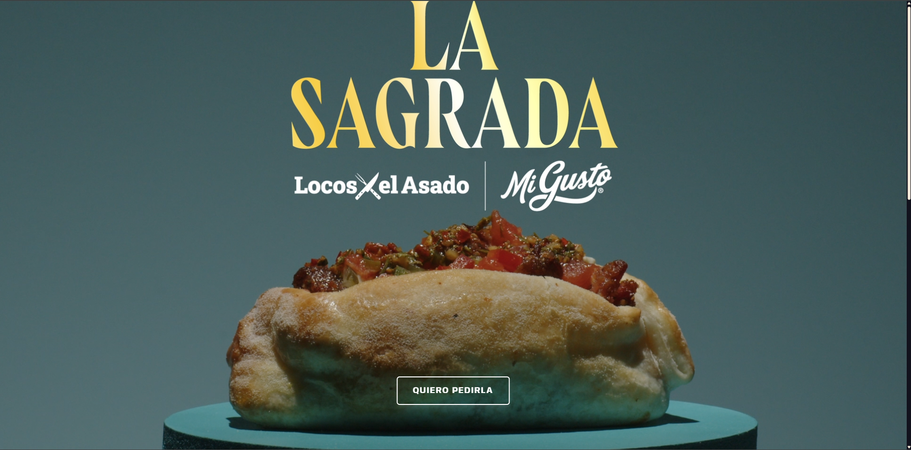
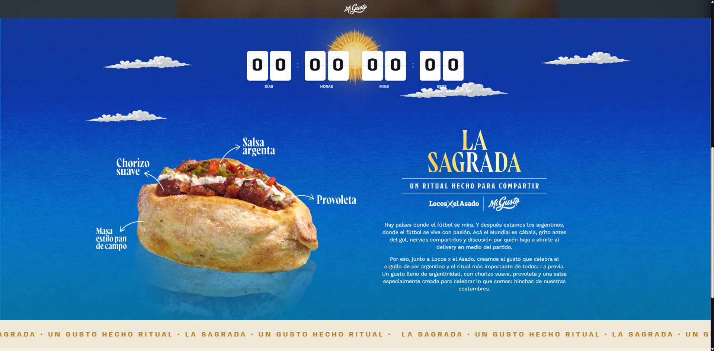
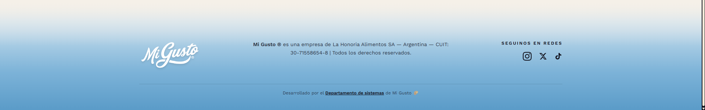

  
  
  # Mi Gusto x La Sagrada
  
  ### *Un ritual hecho para compartir*
  
  
  
  
  
  
  
  ---
  
  **Mi Gusto x La Sagrada** es una experiencia web interactiva y premium desarrollada para celebrar el lanzamiento exclusivo de una empanada artesanal única, creada en colaboración con **Locos x el Asado**. Este desarrollo migra y optimiza un diseño original a una aplicación robusta en React, con animaciones sofisticadas, interactividad fluida y una arquitectura moderna.

## 🎯 Características Principales

*   **✨ Cuenta Regresiva Activa:** Un temporizador dinámico e interactivo estilo *flip card* que actualiza en tiempo real los días, horas, minutos y segundos restantes para el lanzamiento.
*   **📩 Sistema de Waitlist Automatizado:** Formulario integrado directamente con **Supabase** para registrar los correos electrónicos de los usuarios interesados de manera segura y eficiente, con validaciones en tiempo real y feedback animado.
*   **🎬 Animaciones Cinemáticas:** Transiciones y efectos fluidos desarrollados con **GSAP** (GreenSock) y **ScrollTrigger** que revelan elementos de forma sutil y elegante a medida que el usuario navega por la página.
*   **🌌 Efecto Parallax Tridimensional:** Fondo inmersivo y elementos flotantes (como nubes y el sol) que responden de forma reactiva al desplazamiento de la pantalla.
*   **📱 Diseño Totalmente Responsivo:** Una interfaz fluida y adaptada meticulosamente para smartphones, tablets y pantallas de escritorio, garantizando legibilidad y estética en cualquier resolución.
*   **🎨 Estética Premium:** Diseñada en modo oscuro con acentos dorados que evocan elegancia, texturas visuales, tipografías estilizadas y efectos de *glassmorphism* que elevan la percepción de marca.

## 🛠️ Tecnologías y Librerías

El proyecto ha sido construido utilizando estándares de desarrollo modernos para asegurar rendimiento, escalabilidad y una experiencia de usuario sobresaliente:

- **React (v18.2):** Biblioteca principal para la construcción de la interfaz y gestión de estados reactivos.
- **Vite:** Herramienta de compilación ultrarrápida para optimizar el flujo de desarrollo y producción.
- **Tailwind CSS:** Framework de diseño utilitario para garantizar una maquetación ágil, consistente y totalmente responsiva.
- **GSAP & ScrollTrigger:** Motor de animaciones de alto rendimiento para controlar los efectos dinámicos en base al desplazamiento del usuario.
- **Supabase JS Client:** Integración backend como servicio para la recopilación segura de la lista de espera (Waitlist).

## 📷 Vistas Previas del Proyecto

<table align="center" width="100%">
  <tr>
    <td align="center" valign="top" width="50%">
      
       
       
      <em>Pantalla de Pre-Lanzamiento — Cuenta Regresiva y Registro</em>
    </td>
    <td align="center" valign="top" width="50%">
      
       
       
      <em>Sección de Ingredientes — Detalles de La Sagrada</em>
    </td>
  </tr>
  <tr>
    <td align="center" valign="top" colspan="2">
       
      
       
       
      <em>Pie de Página — Redes Sociales y Créditos</em>
    </td>
  </tr>
</table>

## 📄 Licencia

© 2026 MI GUSTO. Todos los derechos reservados.
Desarrollado con pasión por el **Departamento de Sistemas de Mi Gusto**.
